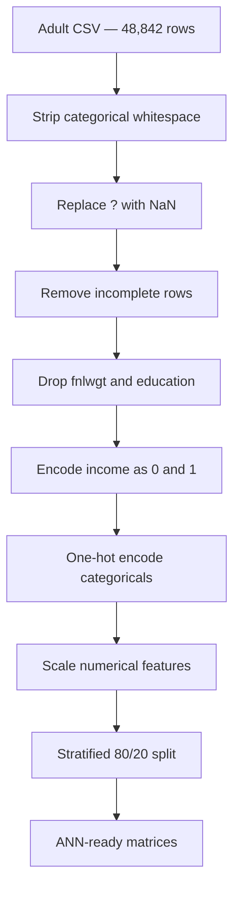

<div align="center">


[](https://git.io/typing-svg)

<br>


<br>


### An experimental deep-learning study for income classification using the Adult Census dataset

Built by **Tushar Vala** as part of **Deep Learning PR 2** at Red & White Skill Education.

[Project Overview](#-project-overview) •
[Experiments](#-seven-controlled-experiments) •
[Results](#-complete-results) •
[Conclusion](#-final-conclusion)

</div>

---

## 📌 Project Overview

This project builds and evaluates Artificial Neural Networks to predict whether an individual's annual income is:

- **Class 0:** `<=50K`
- **Class 1:** `>50K`

The project goes beyond training a single model. It uses a sequence of controlled experiments to investigate how activation functions, weight initializers, loss functions, Batch Normalization and optimizers influence convergence, generalization and minority-class performance.

> [!IMPORTANT]
> The dataset has an approximate **3:1 class imbalance**. A model predicting only class 0 could achieve nearly 75% accuracy. Therefore, this project prioritizes **Precision, Recall, F1-score and ROC-AUC** alongside Accuracy.

### Real-world relevance

Income classification can support analytical systems in:

| Domain | Example application |
|---|---|
| 💳 FinTech | Credit-risk segmentation and financial-product targeting |
| 👥 HR Analytics | Workforce and compensation analysis |
| 🏛️ Public Policy | Benefit-allocation and socioeconomic research |
| 📣 Marketing | Income-based customer segmentation |
| 📊 Census Analytics | Demographic and employment-pattern analysis |

---

## 🎯 Project Objectives

- Build a reusable Multi-Layer Perceptron for structured tabular data.
- clean missing and inconsistent Adult Census records.
- Encode categorical features and scale numerical features correctly.
- Compare four hidden-layer activation functions.
- Measure ReLU dead neurons and sigmoid gradient flow.
- Compare five weight-initialization strategies.
- Study BCE, MSE, Weighted BCE and Focal Loss.
- Examine Batch Normalization behavior and placement.
- Compare convergence across five optimizer configurations.
- Evaluate learning-rate sensitivity for SGD and Adam.
- Select a final model using minority-class F1 and ROC-AUC.

---

## 🗂️ Dataset

The project uses the **Adult Income Dataset**, also known as the Census Income Dataset. It contains demographic and employment information collected from the 1994 United States Census database.

| Property | Details |
|---|---|
| Dataset | Adult Income / Census Income |
| Original records | 48,842 |
| Input features | 14 before preprocessing |
| Target | `income` |
| Problem type | Binary classification |
| Majority class | `<=50K` — approximately 75% |
| Minority class | `>50K` — approximately 25% |
| Missing-value marker | `?` |
| Source | [UCI Machine Learning Repository](https://archive.ics.uci.edu/dataset/2/adult) |

### Main features

```text
age                 workclass             fnlwgt
education           educational-num       marital-status
occupation          relationship          race
gender              capital-gain          capital-loss
hours-per-week      native-country         income
```

> [!NOTE]
> Column names can differ slightly between Adult dataset versions, for example `education.num` versus `educational-num`, or `sex` versus `gender`.

---

## 🧹 Data-Processing Pipeline



### Preprocessing decisions

1. Leading and trailing spaces were removed from string columns.
2. `?` was converted into `NaN`.
3. Rows containing missing categorical values were removed.
4. `fnlwgt` was removed because it is a census sampling weight.
5. Text `education` was removed because the numerical education-level feature already represented its ordered information.
6. Income was encoded as `0` and `1`.
7. Categorical features were one-hot encoded with `drop_first=True`.
8. Only continuous numerical features were standardized.
9. The dataset was split using `stratify=y` to preserve class proportions.

---

## 🧠 Baseline Architecture


| Setting | Baseline configuration |
|---|---|
| Hidden layers | 128 → 64 |
| Hidden activation | ReLU |
| Initializer | Glorot Uniform |
| Output | 1 sigmoid neuron |
| Loss | Binary Cross-Entropy |
| Optimizer | Adam |
| Epochs | 50 |
| Batch size | 64 |
| Validation split | 10% |

Sigmoid is used in the output layer because one probability is sufficient for binary classification. A threshold of `0.5` converts the probability into a predicted class.

---

## 🧪 Seven Controlled Experiments

<details open>
<summary><strong>Task 1 — Data Loading, Cleaning and EDA</strong></summary>

<br>

- Loaded and inspected the complete dataset.
- Removed missing and redundant records/features.
- Encoded the target variable.
- Investigated the 3:1 class imbalance.
- Visualized age, education, working hours and numerical correlations.
- Prepared a stratified train-test split.

</details>

<details>
<summary><strong>Task 2 — Baseline Multi-Layer Perceptron</strong></summary>

<br>

- Created a reusable ANN-building function.
- Built a `128 → 64 → 1` network.
- Verified parameter calculations.
- Trained the baseline for 50 epochs.
- Evaluated Accuracy, Precision, Recall, F1 and confusion matrix.

</details>

<details>
<summary><strong>Task 3 — Activation-Function Comparison</strong></summary>

<br>

Four hidden-layer activations were trained under identical conditions:

| Activation | Main strength | Main risk |
|---|---|---|
| ReLU | Fast and computationally simple | Dead neurons |
| Tanh | Zero-centred outputs | Saturation and vanishing gradients |
| Sigmoid | Smooth probability-like outputs | Strong vanishing-gradient risk |
| ELU | Non-zero negative region and smooth gradients | Slightly more computation |

The experiment also extracted first-layer ReLU outputs to measure zero activations and used `GradientTape` to inspect sigmoid gradient magnitudes.

</details>

<details>
<summary><strong>Task 4 — Weight Initialization</strong></summary>

<br>

The following initializers were compared:

- Glorot Uniform
- Glorot Normal
- He Uniform
- He Normal
- Zeros

The zeros experiment demonstrated the symmetry problem: identical neurons receive identical gradients and remain identical. Initial and trained weight distributions were also visualized for He Normal and Glorot Uniform.

</details>

<details>
<summary><strong>Task 5 — Loss Functions and Class Imbalance</strong></summary>

<br>

| Loss | Purpose |
|---|---|
| Binary Cross-Entropy | Standard binary probability classification |
| Weighted BCE | Increases the penalty for minority-class errors |
| Mean Squared Error | Regression loss tested as an intentionally unsuitable alternative |
| Focal Loss | Concentrates training on hard, misclassified examples |

Weighted BCE produced the highest class-1 Recall, while standard BCE provided a better Precision-Recall balance in the winning model.

</details>

<details>
<summary><strong>Task 6 — Batch Normalization</strong></summary>

<br>

The canonical structure was tested:

```text
Dense (linear) → BatchNorm → ReLU
```

The experiment also compared BatchNorm before and after activation and inspected learned gamma and beta parameters.

</details>

<details>
<summary><strong>Task 7 — Optimizers and Final Model</strong></summary>

<br>

Five optimizer configurations were evaluated:

- Vanilla SGD
- SGD with Momentum
- RMSprop
- Adam
- Explicit Adam

Learning-rate sensitivity was tested using four SGD rates and three Adam rates. The final combined model incorporated ReLU, He Normal, BatchNorm, Adam and Weighted BCE.

</details>

---

## 🏆 Best Model

<div align="center">

### ELU + Glorot Uniform + Binary Cross-Entropy + Adam


</div>

### Why ELU won

ELU achieved the best combination of Accuracy, class-1 F1 and ROC-AUC. Unlike ReLU, ELU allows small negative outputs when the input is below zero. This maintains a gradient path for negative inputs and reduces the dead-neuron problem.

The **90.68% ROC-AUC** indicates strong overall ranking ability across classification thresholds, while the **67.97% class-1 F1-score** represents the strongest tested balance between minority-class Precision and Recall.

---

## 📊 Complete Results

| Rank | Model | Activation | Initializer | Loss | BatchNorm | Optimizer | Accuracy | Precision (1) | Recall (1) | F1 (1) | ROC-AUC |
|:---:|---|---|---|---|:---:|---|---:|---:|---:|---:|---:|
| 🥇 | **Best Activation — ELU** | **ELU** | **Glorot Uniform** | **BCE** | **No** | **Adam** | **85.20%** | **73.29%** | **63.38%** | **67.97%** | **90.68%** |
| 🥈 | Weighted BCE | ReLU | He Normal | Weighted BCE | No | Adam | 80.09% | 56.91% | **81.04%** | 66.86% | 88.82% |
| 🥉 | Baseline | ReLU | Glorot Uniform | BCE | No | Adam | 83.92% | 69.31% | 63.07% | 66.04% | 88.78% |
| 4 | Best Initializer — He Uniform | ReLU | He Uniform | BCE | No | Adam | 83.57% | 70.15% | 58.70% | 63.91% | 88.69% |
| 5 | BatchNorm | ReLU | He Normal | BCE | Yes | Adam | 81.95% | 65.08% | 58.61% | 61.68% | 87.25% |
| 6 | Final Combined | ReLU | He Normal | Weighted BCE | Yes | Adam | 80.73% | 61.93% | 57.76% | 59.77% | 86.24% |
| 7 | Focal Loss | ReLU | He Normal | Focal Loss | No | Adam | 82.76% | **78.58%** | 41.88% | 54.64% | 88.07% |

### Performance highlights

```text
Highest Accuracy      ELU Model        85.20%
Highest Precision     Focal Loss       78.58%
Highest Recall        Weighted BCE     81.04%
Highest F1-score      ELU Model        67.97%
Highest ROC-AUC       ELU Model        90.68%
```

> [!TIP]
> **Choose the ELU model** when balanced classification quality is required. **Choose Weighted BCE** when finding as many true high-income individuals as possible is more important than avoiding false positives.

---

## 🔍 Key Experimental Findings

### 1. Activation choice had the strongest balanced impact

Changing ReLU to ELU improved Accuracy from **83.92% to 85.20%**, class-1 F1 from **66.04% to 67.97%**, and ROC-AUC from **88.78% to 90.68%**.

### 2. Higher Recall does not always mean a better balanced model

Weighted BCE achieved **81.04% Recall**, the best in the project, but Precision fell to **56.91%**. The model detected more high-income individuals at the cost of additional false positives.

### 3. High Precision can hide poor minority coverage

Focal Loss achieved the highest Precision at **78.58%**, but its Recall was only **41.88%**. It made cautious class-1 predictions but missed many actual high-income individuals.

### 4. Theory must be verified experimentally

He initialization is theoretically suited to ReLU, but the He Uniform model did not outperform the Glorot Uniform baseline on the test set.

### 5. Batch Normalization was not automatically beneficial

BatchNorm reduced performance in this shallow tabular network. The numerical inputs were already standardized, and the network contained only two hidden layers, reducing the need for additional normalization.

### 6. Combining more techniques did not create the best model

The Final Combined model used ReLU, He Normal, Weighted BCE, BatchNorm and Adam but achieved only **59.77% class-1 F1**. Model components interact, so individually promising techniques must be validated as a complete configuration.

---

## 📏 Evaluation Metrics

| Metric | Meaning | Why it matters here |
|---|---|---|
| Accuracy | Overall percentage of correct predictions | Useful but potentially misleading with 3:1 imbalance |
| Precision (1) | Correct class-1 predictions divided by all class-1 predictions | Measures false-positive control |
| Recall (1) | Correct class-1 predictions divided by all actual class-1 cases | Measures how many high-income records were detected |
| F1 (1) | Harmonic mean of Precision and Recall | Main balanced minority-class metric |
| ROC-AUC | Ranking quality across all thresholds | Measures overall class separation |

---

## 🛠️ Technology Stack

| Category | Technologies |
|---|---|
| Language | Python 3.11 |
| Deep learning | TensorFlow 2.x, Keras |
| Data processing | Pandas, NumPy |
| Machine learning | scikit-learn |
| Visualization | Matplotlib, Seaborn |
| Development | Jupyter Notebook, VS Code |
| Version control | Git, GitHub |

---

## 📁 Recommended Repository Structure

```text
adult-income-ann-pr2/
│
├── DL_PR2.ipynb
├── adult.csv
├── README.md
├── requirements.txt
│
├── images/
│   ├── class_distribution.png
│   ├── eda_age_income.png
│   ├── correlation_heatmap.png
│   ├── baseline_curves.png
│   ├── activation_comparison.png
│   ├── relu_dead_neurons.png
│   ├── sigmoid_gradient_flow.png
│   ├── initializer_convergence.png
│   ├── weight_distributions.png
│   ├── loss_comparison.png
│   ├── batchnorm_comparison.png
│   ├── optimizer_comparison.png
│   ├── learning_rate_sensitivity.png
│   ├── final_confusion_matrix.png
│   └── roc_curves.png
│
└── reports/
    └── DL_PR2.html
```

> [!WARNING]
> If `adult.csv` is too large or its distribution license requires source attribution, keep it out of the repository and provide the official dataset link instead.

---

## 📦 Requirements

Create `requirements.txt` with:

```text
tensorflow
pandas
numpy
matplotlib
seaborn
scikit-learn
jupyter
ipykernel
```

For exact reproducibility, generate pinned versions after confirming the notebook runs successfully:

```bash
pip freeze > requirements.txt
```

---

## ▶️ Quick Model Example

```python
from tensorflow import keras
from tensorflow.keras import layers

model = keras.Sequential([
    layers.Input(shape=(X_train.shape[1],)),
    layers.Dense(128, activation="elu", kernel_initializer="glorot_uniform"),
    layers.Dense(64, activation="elu", kernel_initializer="glorot_uniform"),
    layers.Dense(1, activation="sigmoid")
])

model.compile(
    optimizer="adam",
    loss="binary_crossentropy",
    metrics=["accuracy"]
)

history = model.fit(
    X_train,
    y_train,
    epochs=50,
    batch_size=64,
    validation_split=0.1
)
```

---

## 🔁 Reproducibility Notes

Neural-network results can change slightly across runs because of:

- Random weight initialization
- Training-validation split order
- Mini-batch shuffling
- TensorFlow version
- CPU versus GPU execution
- Non-deterministic low-level operations

Set seeds before building each comparison model:

```python
import numpy as np
import tensorflow as tf

np.random.seed(42)
tf.keras.utils.set_random_seed(42)
```

For a fair experiment, change only one configuration at a time while keeping the data split, architecture, epochs and batch size constant.

---

## 🚀 Future Improvements

- Tune the classification threshold instead of always using `0.5`.
- Use cross-validation or repeated runs to report mean and standard deviation.
- Add early stopping and restore the best validation weights.
- Tune hidden units, learning rate, batch size and regularization.
- Compare dropout and L1/L2 regularization.
- Use PR-AUC because it is informative for imbalanced classification.
- Compare the ANN against Logistic Regression, Random Forest, XGBoost and LightGBM.
- Use SHAP to explain important income predictors.
- Package preprocessing and prediction into a reusable pipeline.
- Deploy the winning model through FastAPI, Streamlit or a web dashboard.
- Add experiment tracking through TensorBoard or MLflow.

---

## ✅ Final Conclusion

The **ELU activation model** is the recommended model for balanced Adult Income classification.

It achieved:

- **85.20% Test Accuracy**
- **73.29% Class-1 Precision**
- **63.38% Class-1 Recall**
- **67.97% Class-1 F1-score**
- **90.68% ROC-AUC**

ELU improved gradient flow by allowing small negative outputs and reduced the dead-neuron risk associated with ReLU. Combined with Glorot Uniform initialization, Binary Cross-Entropy and Adam, it delivered the best balance of overall accuracy and minority-class recognition.

Weighted BCE remains a valuable alternative for recall-focused applications because it detected **81.04%** of class-1 observations. However, its lower Precision means that this benefit comes with more false positives.

The project demonstrates an essential deep-learning lesson:

> **The most complex model is not always the best model. Controlled experiments and business-relevant evaluation metrics are more important than adding every available technique.**

---

## 👨‍💻 Author

<div align="center">

### Tushar Vala

Aspiring Data Analyst • Python Developer • AI/ML Enthusiast


</div>

---

<div align="center">


**Made with ❤️, Python and TensorFlow**

</div>
